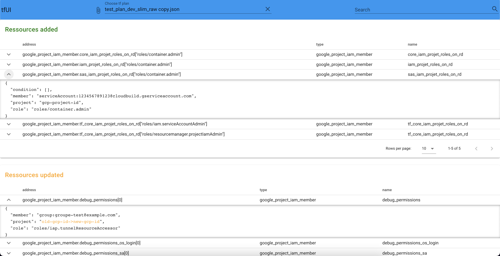

# tfUI



## Description
Simple tool to visualize your terraform plan.
Generate your terraform plan as json with these commands:

```bash
terraform plan -out=./plan/out.txt
terraform show -json ./plan/out.txt
```

Then upload it to tfUI.

## Docker

You can run tfUI with docker:

```bash
docker build -t tfui .
docker run -rm -p 8080:80 tfui
```

Then go to http://localhost:8080.


## Development

This app is build with Vuejs 2. You can setup local environment with npm and run local development server with these commands:

```bash
npm install
npm run serve
```
